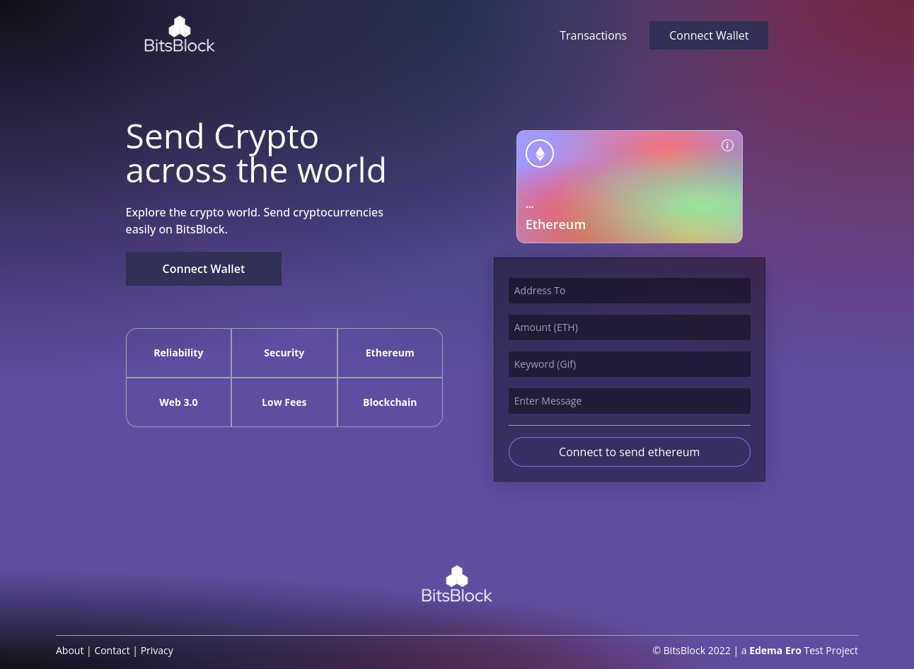

<!-- @format -->

# BitsBlock | Web 3.0 Blockchain App Project

# What I learnt/Tool Used:

<ul>
<li>Web 3.0</li>
<li>Blockchain</li>
<li>How to write & deploy smart contracts to the ethereum network using solidity programming language</li>
</ul>
 

# URL

<a href="https://bits-block.vercel.app/" target="_blank">
https://bits-block.vercel.app/
</a>
 

